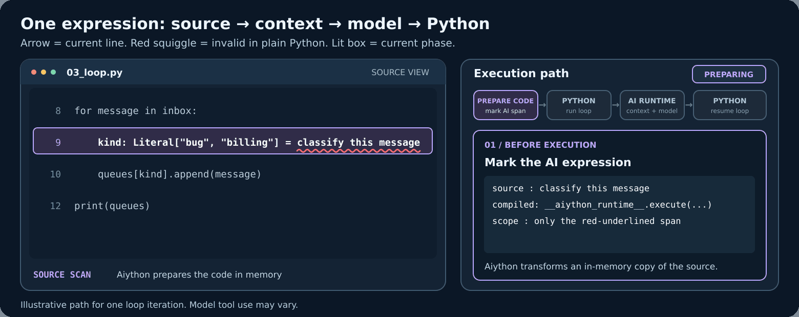

<p align="center"></p>

<h1 align="center">Aiython</h1>

<p align="center"><strong>When Python doesn’t know what to do, Aiython does.</strong></p>

<p align="center"><a href="docs/index.md">Documentation</a> · <a href="examples/recipes/README.md">Examples</a></p>

Aiython runs Python normally and can bring in AI when Python cannot parse the source or continue execution. AI works with the live program state; Python keeps control of execution.

## See the difference




```python
from typing import Literal

tickets = [
    "After uploading a PDF, the ticket page freezes until I refresh the browser.",
    "Could you email last month's invoice and update the billing contact for our team?",
]
queues = {"bug": [], "billing": []}

for ticket in tickets:
    kind: Literal["bug", "billing"] = classify this ticket
    queues[kind].append(ticket)

summary = summarize the routed tickets in one sentence
print(queues, summary)
```


AI classifies each ticket while Python runs the loop. After the loop, one AI call summarizes the routed tickets. The animation shows both classifications and the final summary. Copy or run the [loop example](examples/recipes/03_loop.py).

The red-underlined expressions are invalid in plain Python; Aiython handles them when the file runs.

## Get started

Use CPython **3.11 or newer**. Save the example above as `tickets.py`, then install the standalone command with [uv](https://docs.astral.sh/uv/):

```bash
uv tool install aiython
aiython setup
aiython --explain tickets.py
aiython tickets.py
```

`--explain` shows the AI boundary without running the script or calling a model. `setup` lets you search for a tool-capable model and stores an entered key in a gitignored project file. The last command uses your provider and may incur charges. The PyPI distribution, CLI, and Python import all use **`aiython`**.

| Where you run scripts | Install | Run |
| --- | --- | --- |
| Existing uv project | `uv add aiython` | `uv run aiython ...` |
| Activated virtual environment | `python -m pip install aiython` or `uv pip install aiython` | `aiython ...` |
| Standalone command | `uv tool install aiython` | `aiython ...` |

Use a project environment when your script imports other project dependencies; a uv tool has its own isolated environment. [Setup and configuration](docs/configuration.md) covers profiles, custom endpoints, and capability routes.

Run an importable module or package with `aiython -m package.module` or `aiython -m package`; pass its arguments after the module name.

Ordinary Python runs without loading LiteLLM or contacting a provider. Reasoning calls use the [LiteLLM Python SDK](https://docs.litellm.ai/docs/) in process; no proxy service is needed.

## The execution boundary

1. Execution reaches a source span Python cannot parse or a recovery checkpoint.
2. Aiython exposes the relevant live frame and tools to the model.
3. The model supplies a result or recovery action; Aiython checks declared result types.
4. Control returns to Python.

The model can work with existing objects **without copying them**. Read the [runtime protocol](docs/runtime.md) and [type contracts](docs/type-safety.md) for the exact behavior.

## Explore

| Example | Why it matters |
| --- | --- |
| [Python-first Fibonacci](examples/recipes/06_python_first.py) | Python does the computation; AI explains afterward. |
| [Live object identity](examples/recipes/05_existing_object.py) | AI selects an existing object, not a JSON copy. |
| [Recovery](examples/recipes/04_recovery.py) | A valid Python statement fails, then reaches an AI checkpoint. |
| [Typed result](examples/recipes/01_typed_result.py) | `TypedDict` and `Literal` constrain the answer. |
| [Documents and media](examples/capabilities/README.md) | Use bundled assets with configured capabilities. |
| [Parallel collaboration](docs/collaboration.md) | Python schedules tasks; an optional mailbox connects their AI invocations. |

Use `aiython --explain PATH` to inspect an example offline. The [recipe guide](examples/recipes/README.md) lists the small programs.

## Add only the capabilities you need

`aiython setup` creates or updates a version 3 `aiython.toml` with one main model. Add separate routes only when a program needs vision, documents, embeddings, reranking, speech, images, or video. See the [capability guide](docs/capabilities.md). `--stats` shows model calls, tool use, request size, and timing; `--trace-plan` shows actual capability routes and also executes the script. Video generation stores a resumable job ID. See [performance evaluation](docs/performance-evaluation.md).

## Know the boundary

Aiython is **not a sandbox**. Frame tools can use `eval` and `exec` with your process permissions, and relevant source or object data may be sent to your configured provider. Use trusted code and review provider data handling. Model output, cost, and latency depend on the chosen provider.

Contributions and reproducible bug reports are welcome; see [CONTRIBUTING.md](CONTRIBUTING.md). The offline tests mock providers:

```bash
uv run python -m unittest discover -s tests -q
```

Licensed under [MIT](LICENSE).
