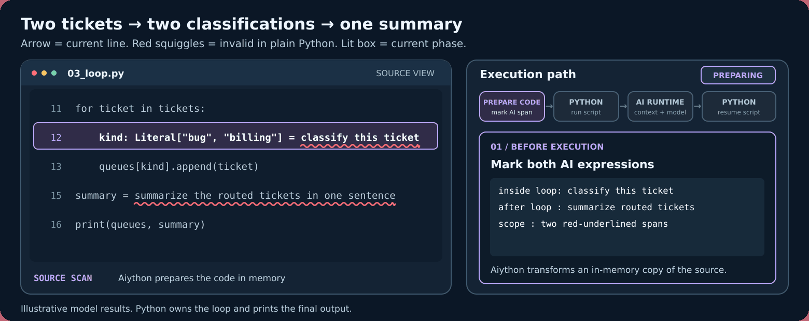

# Aiython

**When Python doesn’t know what to do, Aiython does.**

Aiython runs Python normally and brings in AI when Python cannot parse the source or continue execution. AI works with the live program state; Python keeps control of execution.

[Get started](getting-started.md) · [Browse examples](examples.md)



```python
from typing import Literal

tickets = [
    "After uploading a PDF, the ticket page freezes until I refresh the browser.",
    "Could you email last month's invoice and update the billing contact for our team?",
]
queues = {"bug": [], "billing": []}

for ticket in tickets:
    kind: Literal["bug", "billing"] = classify this ticket
    queues[kind].append(ticket)

summary = summarize the routed tickets in one sentence
print(queues, summary)
```

The two natural-language statements are invalid in plain Python. Aiython handles each one when execution reaches it: two classifications inside the loop, then one summary after the loop. Try the [complete loop example](examples.md#python-loop) or inspect the AI boundary with `aiython --explain PATH` before running it.

## Explore the documentation

- **[Get started](getting-started.md):** install Aiython, configure a model, and run your first script.
- **[Examples](examples.md):** small programs for typed results, state changes, recovery, and capabilities.
- **[Runtime](runtime.md) and [type safety](type-safety.md):** understand what Python executes and what Aiython checks.
- **[Configuration](configuration.md) and [capabilities](capabilities.md):** choose providers and add only the routes your programs need.

!!! warning "Run trusted code"
    Aiython is not a sandbox. Frame tools can use `eval` and `exec` with your process permissions, and relevant source or object data may be sent to your configured provider. Model output, cost, and latency depend on that provider.
